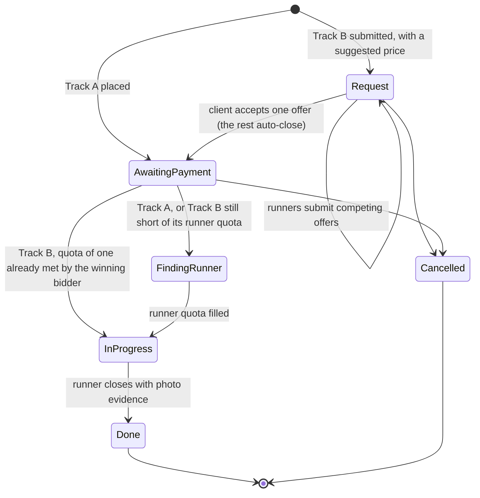

# UPNVJ Suruh

An errand and odd-job service for students at UPN Veteran Jakarta: a mobile app for
clients and runners, a web dashboard for admins, both on top of one REST API.

A client places an order, the system broadcasts the job to available runners, and the
first runner to accept it takes the work. Conversation, payment, and completion evidence
all stay attached to the order they belong to.

Clients and runners share a single app. The surface that opens is decided by the role in
use rather than by a separate build, and one account may hold both.

## Stack

- **Mobile:** Flutter, Dart, Riverpod for state, GoRouter for navigation
- **Admin dashboard:** React, TypeScript, Vite, Vitest
- **API:** ASP.NET Core on .NET 10, Entity Framework Core, SignalR
- **Database:** PostgreSQL
- **Auth:** JWT bearer tokens, one time codes over phone number
- **Payments:** QRIS through a payment gateway, confirmed by webhook

## Service tracks

Six catalogued services: ride and drop off, food delivery, item delivery, moving out of a
boarding house, boarding house cleaning, and bathroom cleaning. Anything outside the list
goes through a free form request.

The split is not cosmetic. It is about who decides the price.

**Track A** covers services whose price follows from the form: ride and drop off, food
delivery, item delivery. The client sees the total before ordering, and the job is
broadcast as soon as it is paid.

**Track B** covers work that a form cannot price on its own, along with every free form
request, and it works like a ride-hailing bidding flow rather than a single centralized
quote. The client describes what they need and names a price they're willing to pay, and
the request broadcasts to every available runner. Any runner who's interested can either
accept the client's suggested price outright or submit a counter-offer of their own — an
order can have several offers pending at once, one per runner, and each runner negotiates
with the client in their own private thread, invisible to every other runner bidding on the
same request. The client can accept one offer, reject it, or ask for a recalculation with a
stated reason (which lands in that same private thread); accepting one offer immediately
closes every other pending offer on that order, and the winning runner is the one who does
the job — there's no separate hand-off to someone else afterward. Admin no longer sets
Track B prices at all; its role is purely monitoring and reconciliation now.

Prices never come from the client alone on either track — a client-suggested price on
Track B is just the opening bid, not a binding number, and the price that actually sticks
still only ever comes from a runner's offer the client accepts, computed and held server
side exactly as before.

## Order lifecycle



What moves an order out of `AwaitingPayment` is the gateway, not the screen and not the
client. There is no way for the app to declare itself paid.

A paid order cannot be cancelled through the cancel endpoint, because cancelling it means
money has to go back, and a refund should not happen as the side effect of one button.

Jobs that need more than one person stay broadcast until the quota is filled. On Track B,
the runner whose offer got accepted fills one slot the moment payment clears — no race
there, the client already chose them. Any slots still open after that (a multi-runner job
like a move-out needs more hands than the one who bid) get broadcast exactly like Track A,
and when two runners accept the same slot at the same moment, one wins and the other is
told the job was taken. That race is settled in the database, under a serializable
transaction with optimistic concurrency, rather than in the interface.

## Layout

```
mobile/    Flutter application, for clients and runners
web/       React admin dashboard
backend/   ASP.NET Core Web API and EF Core
```

## Getting started

Requires Flutter 3.41 or newer, the .NET 10 SDK, and PostgreSQL.

### API

Secrets are not kept in the repository, so each machine sets them once through
`dotnet user-secrets`: the connection string, the JWT signing key, and the payment webhook
secret. The server refuses to start while any of them is missing, and says which, because
a failure at startup is far easier to trace than a failure on the first sign in.

```
cd backend/src/UpnvjSuruh.Api
dotnet user-secrets set "ConnectionStrings:Default" "<postgres connection string>"
dotnet user-secrets set "Jwt:SigningKey" "<random text, at least 32 characters>"
dotnet user-secrets set "Webhook:Secret" "<random text, at least 32 characters, different>"
dotnet ef database update
dotnet run
```

Swagger is served at `/swagger` in development only.

### App

The API address is supplied at build time rather than written into the source:

```
cd mobile
flutter pub get
flutter run --dart-define=API_BASE_URL=http://10.0.2.2:5059
```

`10.0.2.2` is how the Android emulator refers to localhost on the host machine, and it is
also the default. On a physical device, use the machine's address on the same network.

To work on screens without a server or a database:

```
flutter run --dart-define=SUMBER_DATA=tiruan
```

### Dashboard

```
cd web
npm install
npm run dev
```

The API address defaults to `http://localhost:5059` and is overridden with
`VITE_API_BASE_URL` when the server lives somewhere else. Admins sign in with the same
one time code flow as the app; an account simply needs the admin role.

### Android release

A release build needs its own keystore. The debug keystore that ships with Flutter is not
an option, since its key is public and identical on every machine. Until `key.properties`
exists, `flutter build apk --release` produces an unsigned APK that will not install, and
that is deliberate. See `mobile/android/key.properties.contoh`.

## Testing

```
cd mobile && flutter test
cd backend && dotnet test
cd web && npm run tes
```

The API tests start the application in process with their own configuration, so a run
gives the same result on any machine and does not depend on the secrets installed there.

Some of them create a throwaway PostgreSQL database and drop it afterwards. That is on
purpose: what those tests cover is exactly what an in memory provider does not have, and a
test that passes because the provider enforces nothing is worse than no test at all.

## Status

Working end to end across all three surfaces, each covered by its own suite: **513 backend
tests** (against a real Postgres instance, not an in-memory stand-in), **420 mobile tests**,
and **84 dashboard tests**. Every push runs all three on CI.

**Client and runner app.** Registration and sign in, all six catalogued services with their
own forms, Track B's multi-runner bidding from the runner's side (make an offer, withdraw
it, negotiate in a private thread) and the client's side (compare competing offers, accept
one, ask for a recalculation), payment, claiming broadcast jobs, releasing a job already
taken, order chat, completion with photo evidence, runner earnings, editing one's own
profile, changing one's own phone number through a code sent to the new one, requesting
cancellation of a paid order, and repeating a past order in one tap.

**Admin dashboard.** Order monitoring with live updates, cancellation and refunds, role
management, account suspension and restoration with their own audit trails, tariff
settings, and runner payout reconciliation.

**Live updates.** The SignalR hub is consumed on every surface now — the runner's incoming
jobs, the client's payment screen, order chat, and the admin dashboard all react without
polling.

Not built yet:

- **Push notifications, and the WhatsApp fallback for critical status changes.** The single
  largest remaining gap, and the mitigation the plan leans on for its most critical risk:
  battery savers on the phones students actually carry can kill an app's notifications
  silently. It needs a Firebase project and a decision on the WhatsApp provider before any
  of it can be written, let alone proven.
- **A screen for the order status audit trail.** Every status change is recorded — who moved
  it, from what to what, when — but nothing reads that table back yet.
- Object storage for photo evidence, which starts to matter once there is more than one
  server. Exif metadata is already stripped from uploads, so a photo no longer carries the
  runner's GPS location wherever it is stored.
- The payment gateway itself, pending the partner's choice. The flow, the contracts, and
  the webhook are already in their real shape, and none of them depend on which provider is
  picked.
- An APK installed and run on a real handset. Release builds are produced and signed; what
  has not happened is someone holding the phone.
