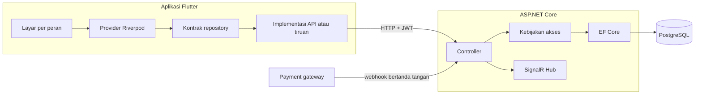
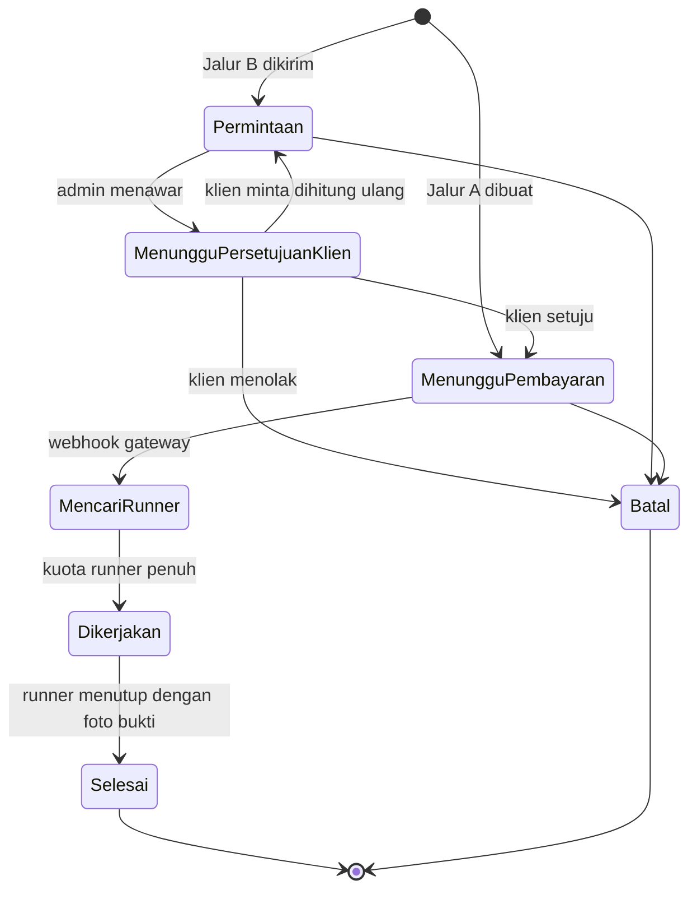
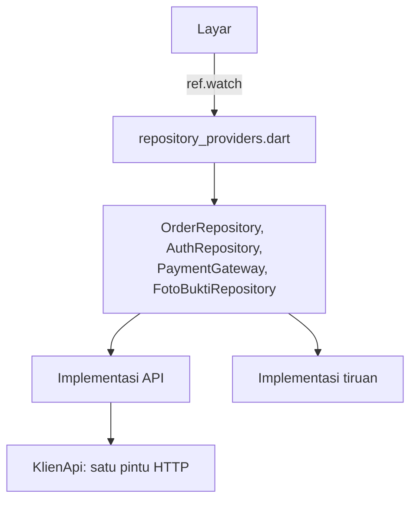

# UPNVJ Suruh

Sistem pemesanan jasa serabutan mahasiswa di lingkungan UPN Veteran Jakarta: aplikasi
Flutter untuk klien dan runner, di atas API ASP.NET Core dengan PostgreSQL.

Klien memesan bantuan, sistem menyiarkan pekerjaannya ke seluruh runner, dan runner
pertama yang menerima langsung mengerjakannya. Percakapan, pembayaran, dan bukti
pekerjaan tersimpan menempel pada ordernya masing-masing.

Klien dan runner memakai satu aplikasi yang sama. Permukaan yang terbuka ditentukan peran
yang sedang dipakai, bukan aplikasi yang berbeda, dan satu akun boleh memegang keduanya
sekaligus.

## Daftar isi

- [Bentuk sistem](#bentuk-sistem)
- [Dua jalur layanan](#dua-jalur-layanan)
- [Siklus hidup order](#siklus-hidup-order)
- [Konkurensi: inti teknis proyek ini](#konkurensi-inti-teknis-proyek-ini)
- [Model otorisasi](#model-otorisasi)
- [Lapisan data aplikasi](#lapisan-data-aplikasi)
- [Struktur repositori](#struktur-repositori)
- [Menjalankan](#menjalankan)
- [Pengujian](#pengujian)
- [Batas yang diakui](#batas-yang-diakui)

## Bentuk sistem



Aplikasi tidak pernah bicara ke payment gateway secara langsung. Ia meminta tagihan ke
servernya sendiri, dan server yang memegang kunci gateway serta menerima webhook.

## Dua jalur layanan

Enam layanan berkatalog: Anter Jemput, Jastip Makanan, Jastip Barang, Bantu Pindah Kos,
Bersih-Bersih Kos, dan Bersih Kamar Mandi. Di luar itu ada pintu Permintaan Lain.

Pemisahannya bukan soal tampilan, melainkan soal siapa yang menentukan harga.

**Jalur A** mencakup layanan yang harganya bisa dihitung dari isian form: Anter Jemput,
Jastip Makanan, Jastip Barang. Klien tahu totalnya sebelum menekan pesan, dan ordernya
tersiar begitu terbayar.

**Jalur B** mencakup pekerjaan yang tidak bisa ditebak dari form: pindah kos,
bersih-bersih, dan seluruh permintaan bebas. Klien menuliskan kebutuhannya, admin membaca
dan bertanya lewat chat ordernya, lalu mengirim penawaran berisi harga, perkiraan durasi,
dan jadwal yang disanggupi. Klien punya tiga jalan keluar: setuju, minta dihitung ulang
dengan menuliskan alasannya, atau menolak sekaligus membatalkan. Alasan permintaan hitung
ulang masuk ke chat ordernya, supaya jawabannya berada di tempat yang sama dengan
pertanyaannya.

Harga tidak pernah datang dari klien di jalur mana pun. Endpoint Jalur A cuma menerima
jenis layanan dan jarak lalu menghitung sendiri, dan jumlah tagihan diambil dari harga
order tersimpan, bukan dari badan permintaan.

## Siklus hidup order



Yang memindahkan order dari `MenungguPembayaran` bukan layar dan bukan klien, melainkan
kabar dari gateway. Aplikasi klien tidak punya satu pun endpoint untuk menyatakan dirinya
sudah membayar, dan kontrak repository di sisi Flutter juga tidak punya methodnya.

Order yang sudah terbayar tidak bisa dibatalkan lewat endpoint pembatalan, karena
membatalkannya berarti ada uang yang harus kembali, dan pengembalian uang tidak boleh
terjadi sebagai efek samping satu tombol.

## Konkurensi: inti teknis proyek ini

Tujuh orang mengerjakan order yang sama-sama terlihat di layar mereka. Perebutan bukan
kasus tepi di sini melainkan kejadian sehari-hari, jadi penjagaannya ada di lapisan basis
data, bukan di lapisan layar.

**Perebutan order.** Penerimaan order berjalan di dalam transaksi dengan isolasi
`Serializable`, dan kolom sistem `xmin` Postgres dipakai sebagai token konkurensi EF Core.
Dua runner yang menekan TERIMA bersamaan menghasilkan satu pemenang; yang kalah menerima
jawaban bahwa ordernya sudah diambil, bukan pesan galat. Order yang butuh tiga orang tetap
tersiar sampai kuotanya penuh.

Kegagalan serialisasi Postgres (SQLSTATE `40001`) ditelusuri menyusuri seluruh rantai
`InnerException`, bukan satu lapis. EF Core membungkus ulang galat yang sama sedalam yang
ia perlukan, dan pemeriksaan satu lapis membuat runner yang cuma kalah cepat melihat
aplikasinya rusak.

**Index unik parsial.** Beberapa aturan yang tidak bisa dijaga kode ditegakkan skema:

- satu order hanya boleh punya satu penawaran berstatus menunggu, sehingga penawaran kedua
  tidak diam-diam menimpa yang sedang dibaca klien
- satu order hanya boleh punya satu tagihan berstatus menunggu, sehingga membuka ulang
  layar bayar tidak menerbitkan QR kedua untuk pekerjaan yang sama
- satu runner hanya boleh sekali ditugaskan pada satu order
- nomor HP unik, sehingga dua pendaftaran yang tiba bersamaan tidak keduanya lolos

**Kode order.** Kode yang dibaca manusia (`SRH-0412`) dibangkitkan sequence Postgres lewat
`DEFAULT`, bukan dihitung aplikasi, supaya order yang lahir bersamaan tetap dapat kode
berbeda.

## Model otorisasi

Peran adalah himpunan, bukan nilai tunggal: satu akun boleh memegang klien dan runner
sekaligus, dan permukaan yang terbuka ditentukan peran yang sedang dipakai.

Aturan yang dipegang di seluruh sistem:

- **Identitas datang dari token, tidak pernah dari badan permintaan.** Kontrak repository
  di sisi Flutter bahkan tidak punya tempat menyebutkan siapa pemanggilnya, karena apa pun
  yang boleh disebut aplikasi bisa diganti aplikasi.
- **Pendaftaran mandiri selalu melahirkan klien.** Peran runner dan admin hanya diberikan
  admin lewat endpoint tersendiri, dan setiap pemberian meninggalkan jejak berisi siapa,
  kapan, dari peran apa ke peran apa, dan alasannya. Alasannya wajib, karena catatan tanpa
  alasan cuma memberi tahu bahwa sesuatu terjadi.
- **Yang tidak berhak dijawab 404, bukan 403.** Membedakan "tidak ada" dari "ada tapi bukan
  urusanmu" memberi tahu orang asing bahwa ordernya ada, dan ia bisa memetakan berapa
  banyak order yang berjalan dengan mencoba banyak id.
- **Aturan akses order ditulis sekali** dan dipakai semua controller yang menyentuh order.
- **Peran penulis pesan diturunkan server** dari hubungan pengirim dengan ordernya, lalu
  disimpan sebagai fakta sejarah, bukan dihitung ulang saat dibaca. Pencabutan peran
  seseorang tidak boleh mengubah label percakapan yang sudah lewat.
- **Webhook membuktikan dirinya dengan rahasia bersama** yang dibandingkan dalam waktu
  tetap, karena ia bukan pengguna yang masuk lewat token.
- **Kode sekali pakai** dibangkitkan pembangkit kriptografis, disimpan sebagai sidik,
  dibandingkan dalam waktu tetap, berbatas waktu, sekali pakai, dan hangus setelah sejumlah
  tebakan salah. Permintaan kode menjawab sama persis untuk nomor terdaftar maupun tidak,
  supaya langkah itu tidak bisa dipakai memeriksa siapa saja yang punya akun.
- **Foto bukti hanya diterima kalau server sendiri yang menerbitkannya.** Endpoint
  penutupan order memeriksa bahwa URL-nya menunjuk berkas yang masih dipegang server; tanpa
  itu, "wajib ada foto bukti" cuma berarti "wajib ada tulisan di kolom foto". Nama berkas
  dibuat server, dan jenis gambarnya ditentukan dari byte awal berkasnya, bukan dari
  `Content-Type` maupun nama kiriman.
- **Token sesi disimpan di Keystore dan Keychain**, bukan di berkas preferensi biasa.

## Lapisan data aplikasi

Tidak ada layar yang memanggil server. Semua akses lewat kontrak abstrak, dan
implementasinya dipasang di satu berkas provider.



`KlienApi` adalah satu-satunya tempat aplikasi bicara HTTP, jadi hal yang harus benar di
setiap permintaan hanya ditulis sekali: header, token, batas waktu, multipart, dan
penerjemahan galat. Galat dibedakan menurut apa yang harus dilakukan pengguna, bukan
menurut kode HTTP-nya, dan isi galat 5xx sengaja tidak sampai ke layar karena jejak galat
server adalah bocoran gratis soal bentuk dalam sistem.

Kontrak berbentuk `Stream`, sementara API-nya tanya-jawab biasa. Jembatannya: perubahan
yang dibuat aplikasi ini sendiri menabuh penyegaran seketika, sedangkan perubahan yang
dibuat orang lain dijaring pengambilan berkala sebagai jaring pengaman sementara sampai hub
SignalR tersambung.

Sumber data dipilih saat build lewat `--dart-define=SUMBER_DATA`, bawaannya `api`.
Implementasi tiruan dipertahankan supaya layar bisa diuji tanpa server dan basis data, tapi
saklarnya menolak menyerahkannya di build rilis, dengan melempar, bukan diam-diam jatuh ke
`api`.

## Struktur repositori

```
mobile/
  lib/core/          tema, routing, konfigurasi tarif, klien HTTP, pemformat
  lib/domain/        model, enum, state machine order, kontrak repository
  lib/data/api/      implementasi yang bicara ke API, pemetaan JSON
  lib/data/fake/     implementasi in-memory untuk pengujian dan demo
  lib/providers/     penyedia Riverpod, titik tukar implementasi
  lib/features/      layar, dikelompokkan per peran dan per alur
  test/              pengujian unit, widget, dan pemetaan jawaban server

backend/
  src/UpnvjSuruh.Api/Controllers/   endpoint
  src/UpnvjSuruh.Api/Domain/        entitas dan enum
  src/UpnvjSuruh.Api/Data/          DbContext, skema, index
  src/UpnvjSuruh.Api/Auth/          JWT, kode sekali pakai, peran
  src/UpnvjSuruh.Api/Payments/      penyelesai pembayaran
  src/UpnvjSuruh.Api/Media/         penyimpanan foto bukti
  src/UpnvjSuruh.Api/Migrations/    migrasi EF Core
  tests/                            pengujian integrasi terhadap Postgres sungguhan
```

## Menjalankan

Butuh Flutter 3.41 atau lebih baru, SDK .NET 10, dan PostgreSQL.

### Backend

Rahasia tidak disimpan di dalam repositori, jadi sekali per mesin perlu diisi lewat
`dotnet user-secrets`: connection string, kunci penanda tangan JWT, dan rahasia webhook
pembayaran. Server menolak menyala kalau salah satu belum ada, lengkap dengan keterangan
mana yang kurang, karena gagal saat start jauh lebih mudah ditelusuri daripada gagal di
permintaan login pertama.

```
cd backend/src/UpnvjSuruh.Api
dotnet user-secrets set "ConnectionStrings:Default" "<connection string Postgres>"
dotnet user-secrets set "Jwt:SigningKey" "<teks acak minimal 32 karakter>"
dotnet user-secrets set "Webhook:Secret" "<teks acak minimal 32 karakter, berbeda>"
dotnet ef database update
dotnet run
```

Swagger terbuka di `/swagger`, hanya di Development.

Peran hanya bisa diberikan admin, jadi sistem yang belum punya admin tidak punya jalan
mengangkat siapa pun. Jalan keluarnya lewat konfigurasi server, bukan lewat API: yang bisa
mengangkat admin pertama adalah orang yang memegang rahasia mesinnya. Setelan itu
mempromosikan akun yang sudah mendaftar sendiri, dan tidak pernah membuat akun baru, karena
jalan kedua melahirkan akun adalah jalan yang lupa diperiksa.

### Aplikasi

Alamat backend diisi saat build, tidak ditulis mati:

```
cd mobile
flutter pub get
flutter run --dart-define=API_BASE_URL=http://10.0.2.2:5059
```

`10.0.2.2` adalah cara emulator Android menyebut localhost mesin induknya, dan itu juga
nilai bawaannya. Di perangkat fisik, ganti dengan alamat IP mesin di jaringan yang sama.

Untuk menjalankan tanpa server dan basis data, misalnya saat menggarap layar:

```
flutter run --dart-define=SUMBER_DATA=tiruan
```

### Rilis Android

Build rilis butuh keystore sendiri; debug keystore bawaan Flutter tidak boleh dipakai
karena kuncinya publik dan sama di setiap mesin. Selama `key.properties` belum ada,
`flutter build apk --release` menghasilkan APK tanpa tanda tangan yang gagal dipasang, dan
itu disengaja. Lihat `mobile/android/key.properties.contoh`.

## Pengujian

```
cd mobile && flutter test
cd backend && dotnet test
```

Tes backend menyalakan API di dalam proses lewat `WebApplicationFactory` dengan
konfigurasinya sendiri, jadi hasilnya sama di mesin siapa pun dan tidak bergantung pada
rahasia yang terpasang di sana.

Sebagian tes membuat basis data Postgres sekali pakai lalu menghapusnya lagi, dan itu
disengaja: yang diuji justru hal-hal yang tidak dimiliki penyedia in-memory, yaitu index
unik, index parsial, isolasi transaksi, dan pemetaan peran ke `integer[]`. Tes yang lolos
karena penyedianya tidak menegakkan apa-apa lebih buruk daripada tidak ada tes. Alamat
Postgres-nya bisa diatur lewat environment variable `UPNVJ_TEST_DB`.

Pemetaan jawaban API diuji terhadap contoh yang benar-benar ditangkap dari server yang
berjalan, bukan yang dikarang. Bentuk JSON adalah hal yang paling gampang salah diasumsikan
dan paling sunyi kalau salah: field yang keliru namanya cuma jadi `null`, dan layar
menampilkan kolom kosong tanpa ada yang tampak rusak.

Nilai enum yang tidak dikenal sengaja melempar, bukan diam-diam jatuh ke nilai pertama,
karena status order yang salah baca membuat layar menawarkan tombol yang tidak seharusnya
ada.

## Batas yang diakui

- **Dashboard admin belum ada.** Penawaran Jalur B dan pemberian peran sudah punya
  endpoint, tapi permukaannya belum dibangun. Admin bekerja lewat web, bukan aplikasi ini.
- **Hub SignalR belum tersambung ke aplikasi.** Kabar perubahan masih dijaring pengambilan
  berkala, yang boros dan disadari sementara.
- **Foto bukti disimpan di cakram server.** Penyimpanan objek baru punya arti ketika
  servernya lebih dari satu. Seam-nya ada di satu kelas.
- **Gateway pembayaran belum dipilih mitra.** Alur, kontrak, dan webhook sudah berbentuk
  yang sebenarnya; yang menggantikannya sementara adalah tiruan yang cuma terdaftar di
  Development, dan sengaja tidak menyerupai payload QRIS asli supaya gagal dipindai
  aplikasi bank.
- **Jastip Makanan belum punya form**, menunggu keputusan mitra soal siapa yang menalangi
  harga barang.
